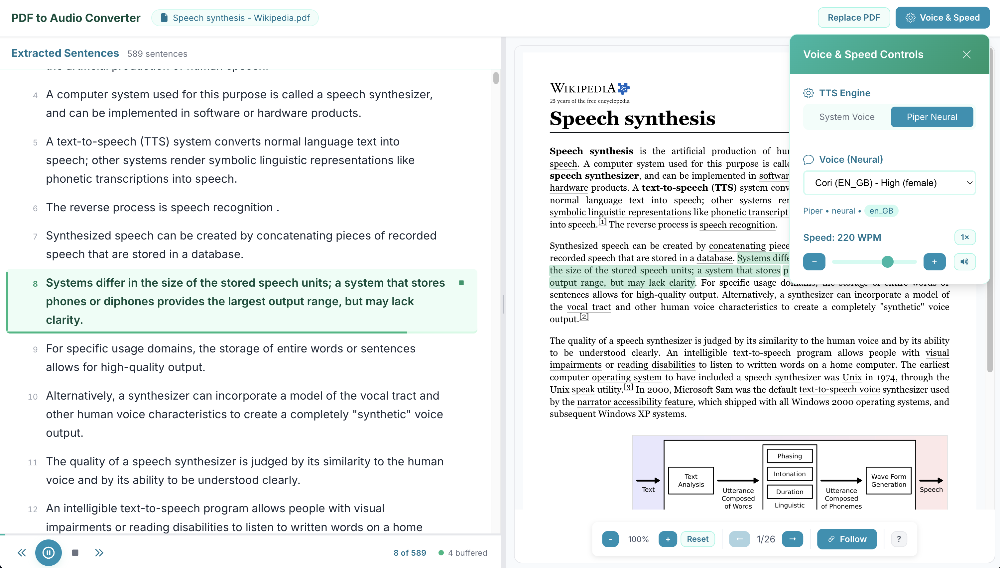

# PDF Narrator
Text-to-Speech synthesizer for PDFs (python tts, node.js, react) (Vibe coding project assisted by Claude Sonnet 4)

<figure align="center">
  
  <figcaption><em>PDF Narrator web interface</em></figcaption>
</figure>

## Features

### Core Functionality
- **PDF Text Extraction**: Upload PDF files and automatically extract text content using `pdf-parse`
- **Intelligent Sentence Splitting**: Smart sentence detection and splitting using NLTK for natural speech flow,
  with citation stripping, hyphenated line-break repair and vocabulary substitutions for readable speech
- **Page Attribution**: Every sentence is tagged with the PDF page it came from
- **Dual TTS Engines**:
  - **Pyttsx3**: System-integrated TTS with platform-native voices
  - **Piper**: High-quality neural TTS with multiple voice models (Cori, Aru, Lessac, Ryan)
- **Real-time Audio Generation**: On-demand audio synthesis with intelligent caching

### Interface
The app fills the viewport: a slim app bar over two panes - the sentence transcript on the
left, the PDF on the right - each scrolling independently.

- **Transcript view**: Numbered sentences with a measured reading column. The whole row is a
  button, so it is clickable and keyboard-navigable; the play affordance appears on hover or focus
- **Resizable split**: Drag the divider between the panes, or focus it and use the arrow keys
  (Shift for larger steps, Home to recentre, double-click to reset). The position is remembered
- **Playback indicators**: The active sentence is highlighted in green with a progress bar along
  its bottom edge tracking position within the clip; the transport bar shows "42 of 399" and a
  document-level progress rail
- **Synced PDF pane**: The PDF turns to the page of the sentence being read, and that sentence is
  highlighted in the page's text layer. A **Follow** toggle controls this; paging by hand switches
  it off so manual browsing is not hijacked
- **Transport bar**: Docked under the transcript - previous / play-pause / stop / next, plus a
  buffering indicator, with spacebar and arrow-key shortcuts
- **Voice & Speed popover**: Engine switch, voice picker, speed slider with a `1x` reset, and a
  **Preview** button that speaks a sample in the selected voice at the selected rate
- **Responsive**: Below 1024px the panes become tabs; usable down to 768px
- **Accessible**: Keyboard shortcuts yield to form controls, icon buttons are labelled, and a live
  region announces the sentence being read

### Advanced Features
- **Smart Audio Caching**:
  - Intelligent preloading of upcoming sentences for seamless playback
  - Automatic cleanup of distant audio files to manage storage
  - Buffering state surfaced on the transport bar
- **Persistent Settings**: Engine, voice, speed and pane split are restored on reload

## Requirements

- **Node.js** 18+ (developed on v22)
- **Python** 3.10+ (developed on 3.12)
- **ffmpeg** on your `PATH` - the pyttsx3 engine converts its output to MP3 for browser playback

## Quick Start

The easiest way to set up and run the PDF Narrator application is using the automated setup script:

```bash
chmod +x ./run.sh  # Make the script executable
./run.sh           # Setup dependencies and start both frontend and backend
```

This script will:
- Create a Python virtual environment at `.venv` (if needed)
- Install all Node.js dependencies for frontend and backend
- Install Python dependencies for TTS functionality
- Start the backend server on port 3001, wait for it to bind, then start the frontend

The frontend opens automatically in your browser. It prefers port 3000 and falls back to the
first free port among 3002-3005 if 3000 is taken - watch the script's output for the URL it
chose. The backend always uses port 3001.

## Manual Setup (Alternative)

If you prefer to set up the components individually:

### Backend Setup
1. Navigate to the backend directory:
   ```bash
   cd backend
   ```

2. Install Node.js dependencies:
   ```bash
   npm install
   ```

3. Install Python dependencies for TTS:
   ```bash
   pip install -r requirements.txt
   ```

### Frontend Setup
1. Navigate to the frontend directory:
   ```bash
   cd frontend
   ```

2. Install React dependencies:
   ```bash
   npm install
   ```

### Manual Development Mode
Start the backend server (runs on port 3001):
```bash
cd backend && npm run dev
```

In a new terminal, start the frontend:
```bash
cd frontend && npm start
```

The frontend calls the backend directly at `http://localhost:3001` (the backend enables CORS).
Override that with `REACT_APP_API_URL` if the backend runs elsewhere:

```bash
cd frontend && REACT_APP_API_URL=http://localhost:4001 npm start
```

## Testing

```bash
cd frontend && npm test          # watch mode
cd frontend && CI=true npm test  # single run
```

Covers the audio cache, the audio manager, and the PDF text-layer sentence matching.

> **Known issue:** `App.test.tsx` currently fails to run - Jest cannot parse `react-pdf`'s ESM
> build without extra transform configuration. The other three suites pass.

## Speech Speed

Speed is measured in **words per minute**, with **180 WPM as 1x**. The pyttsx3 engine takes the
value directly; for Piper the backend converts it to a length multiplier (`speed / 180`), clamped
to 0.5x-2.0x. That clamp means Piper's audible range is roughly 90-360 WPM, so values below 90
sound identical on Piper while pyttsx3 keeps slowing down.
